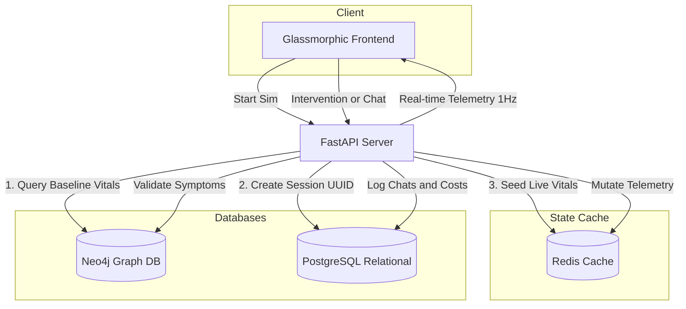

# PulseSim: Codebase Architecture Blueprint

This document outlines the complete architectural layout, module responsibilities, data flow pathways, and state management rules for the **PulseSim** medical simulation engine.

---

## 🏗️ 1. Directory Structure Map

```
d:/PulseSim/
│
├── scripts/
│   ├── init_neo4j.cypher           # Graph Database Seeding (constraints, symptoms, cases)
│   └── init_postgres.sql           # Relational Database Schema (users, sims, chats, audits)
│
├── frontend/                       # Translucent Glassmorphic Client
│   ├── index.html                  # Layout structure, SVGs, modals
│   ├── style.css                   # Responsive CSS grid, neon vital alerts, EKG animations
│   └── app.js                      # WS listeners, state recovery logic, HTTP client REST queries
│
├── backend/                        # FastAPI Asynchronous State Server
│   ├── requirements.txt            # Package manifest (FastAPI, LangGraph, Neo4j, Redis)
│   ├── .env.example                # Connection templates
│   ├── .env                        # Local execution parameters
│   │
│   ├── app/                        # Main Application Package
│   │   ├── __init__.py
│   │   ├── main.py                 # REST routes, WebSocket controllers, 1Hz ticker loop
│   │   ├── config.py               # Pydantic Settings
│   │   │
│   │   ├── db/                     # Async DB Interfaces
│   │   │   ├── __init__.py
│   │   │   ├── neo4j_client.py     # Symptom verification & lab profiles cypher query wrapper
│   │   │   ├── postgres_client.py  # User profiles, chat transcripts, & cost logging
│   │   │   └── redis_client.py     # Live telemetry key-value hash cache
│   │   │
│   │   ├── schemas/                # REST Pydantic Validations
│   │   │   ├── __init__.py
│   │   │   └── sim_schemas.py      # Serialization objects
│   │   │
│   │   └── services/               # Core Engine Computations
│   │       ├── __init__.py
│   │       ├── telemetry.py        # Deterioration calculus & drug stabilization vectors
│   │       └── agent.py            # LangGraph routing, dialog context, & rubric evaluator
│   │
│   └── tests/                      # Automated Verification Suites
│       ├── __init__.py
│       ├── test_telemetry.py       # Telemetry equation bounds and Epi ticks tests
│       └── test_agent.py           # LangGraph router, persona response, and grader tests
│
└── run_pulsesim.ps1                # PowerShell launcher bootstrap
```

---

## 🔄 2. Data Flow & State Lifecycles

PulseSim uses a **hybrid database model** separating transient state, permanent audit logs, and graph-based clinical truth:



1. **Simulation Seeding**:
   - Baseline clinical variables are pulled from **Neo4j** case nodes.
   - Postgres registers the session metadata, returning a session UUID.
   - Redis holds the live, transient values (`vitals_hr`, `vitals_bps`, etc.) in a hash key (`sim:{uuid}:state`).
2. **Physiological Ticker Loop**:
   - A 1Hz background task in `main.py` fetches active simulation IDs from Redis.
   - Telemetry parameters deteriorate each second (e.g. Anaphylaxis: SpO2 decays by 0.5%/sec, BPS decays by 0.8 mmHg/sec).
   - If SpO2 drops to $\le 45\%$ or BPS drops to $\le 40$ mmHg, the ticker changes the status to `failed` (patient coded), updates PostgreSQL, and closes the session.
3. **Interventions**:
   - Triggered instantly (<200ms) by the frontend client via `POST /api/simulation/{sim_id}/intervention`.
   - Modifies Redis state immediately and schedules a vital recovery curve (e.g., Epinephrine counteracts decay for 60 seconds).
   - Logs the transaction cost and simulated time penalty in PostgreSQL.
4. **Chat routing (LangGraph)**:
   - Chat input from the timeline is passed to `POST /api/simulation/{sim_id}/chat`.
   - The **InputRouter** determines intent (Inquiry vs. Intervention vs. Submission).
   - Inquiries prompt **ContextFetcher** to query Neo4j for presenting symptoms. The **PersonaEngine** then synthesizes a patient voice matching the baseline profile and active anxiety level.
5. **Grading & Shutdown**:
   - Triggered upon diagnostic submission or case failure.
   - The **EvaluationEngine** aggregates the PostgreSQL log history.
   - Grades the student on Diagnostic Accuracy, Bedside Tone, and Financial Resource Efficiency.
   - Removes the live cache from Redis and pushes final parameters to the UI.

---

## 📡 3. Communication Protocols & Contracts

### WebSocket Broadcast (Server to Client: 1Hz telemetry updates)
```json
{
  "type": "vitals_update",
  "sim_id": "8b08d4b3-c15c-44da-96ef-2782bcfdbd1a",
  "case_id": "case_anaphylaxis_001",
  "status": "running",
  "elapsed_seconds": 24,
  "simulated_minutes": 8,
  "vitals_hr": 118.4,
  "vitals_bps": 83.2,
  "vitals_bpd": 49.5,
  "vitals_spo2": 88.5,
  "vitals_temp": 36.8,
  "anxiety": 92.5,
  "stabilized": false,
  "budget_remaining": 950.00
}
```

### WebSocket Termination Broadcast
```json
{
  "type": "simulation_ended",
  "status": "failed",
  "reason": "Patient coded. Cardiorespiratory arrest occurred."
}
```
